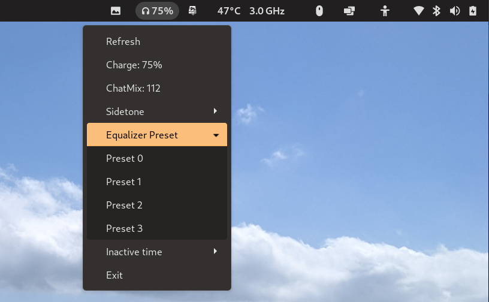

[](https://github.com/centic9/headset-charge-indicator/releases)
[](https://github.com/centic9/headset-charge-indicator/releases/latest)
[](https://github.com/centic9/headset-charge-indicator/tags)

A simple app-indicator for GNOME desktops to provide support for controlling some features of
various wireless headsets.



It supports displaying the battery charge, turning on/off LEDs and adjusting the sidetone level of the microphone. 

It additionally supports displaying the 'chat-mix' level of Steelseries Arctis headphones.

It uses the tool from https://github.com/Sapd/HeadsetControl/ for connecting to a number of
popular headsets and fetches information for displaying in the app-indicator bar on the desktop.

If an additional external script is provided, it also allows to switch between sending sound to the soundcard or to
the Headset and record from the correct microphone.

## Installation

On Ubuntu/Debian based distributions, install the following packages:

    sudo apt-get install python3-gi libappindicator3-1 gnome-icon-theme gir1.2-ayatanaappindicator3-0.1

On Arch Linux, it should be sufficient to run the following steps:

    sudo pacman -S libappindicator-gtk3 gnome-icon-theme

On other distributions, you might need to install `pygobject`, but this is untested, PRs with 
more information welcome!

### Building HeadsetControl

Follow the instructions at https://github.com/Sapd/HeadsetControl/ for building the binary and
note down the path to it.

You can test the helper application manually via `headsetcontrol -b -c`, this should print the current
battery level to the console if your headset is supported.

### Starting the AppIndicator automatically 

You can use the provided script `install.sh` to create an auto-start entry to start up headset-charge-indicator
whenever the Desktop Environment is starting up.

## Usage

Build/install the required executable `headseatcontrol` according to the instructions 
above, then start the headset-charge-indicator via 

    python3 headset-charge-indicator.py

A Headset-icon should appear in the area for app-indicators together with a percentage number.

You can optionally supply a path to the `headsetcontrol` binary.

If you provide a commandline argument `--switch-command`, an additional "Switch" menu will be added with 
options to switch between Soundcard and some Headsets and USB devices. The provided application or script will be
invoked with "1" for soundcard, "2" for headset, "3" for an USB headset and "4" for a chat-device
(it should be easy to adjust this for your devices).

A script can for example use pactl and/or pacmd to send audio output to the correct endpoint
as well as setting audio input to the correct microphone.

### Commandline

```
$ ./headset-charge-indicator.py -h
usage: headset-charge-indicator.py [-h] [--headsetcontrol-binary <path to headsetcontrol binary>] [--switch-command <device switch command>] [--verbose]

    Simple AppIndicator which uses the HeadsetControl application from https://github.com/Sapd/HeadsetControl/ for retrieving charge information for wireless headsets and displays it as app-indicator
    
    The application has two optional commandline arguments, one for the location of the HeadsetControl binary and one for a command to switch between Laptop, Headset and other devices.
    

optional arguments:
  -h, --help            show this help message and exit
  --headsetcontrol-binary <path to headsetcontrol binary>
                        Optional path to headsetcontrol binary
  --switch-command <device switch command>
                        Optional command to switch between Laptop, Headset and other devices
  --verbose             Increase output verbosity
```

## Supported Headsets

Look at the description of https://github.com/Sapd/HeadsetControl/, headset which support 
at least fetching battery information are supported here as well, other functionality will work 
if the headset supports it.

## Supported Desktop Envrionemnts

The tool uses Python bindings for the GNOME appindicator functionality. So it is mainly supported 
on this desktop environment. 

However some other Desktop environments have some support for appindicators, so it might be 
possible to run this tool on other desktop environments as well.

Currently known behavior/support:

* GNOME: Works fully
   * Note: On Debian/Ubuntu you might need to install package `gnome-shell-extension-appindicator`.
   * On other distributions, you will need to install the KStatusNotifierItem/AppIndicator Support from
   https://extensions.gnome.org/extension/615/appindicator-support/
        * After installation run `gnome-shell-extension-prefs` and enable `KStatusNotifierItem/AppIndicator Support`
* Cinnamon: Seems to work, but percentage is not displayed as part of the indicator-icon
* KDE/Plasma: Seems to work, but percentage is not displayed as part of the indicator-icon
* MATE: Runs, but does not display an icon
* LXDE: Seems to work, but percentage is not displayed as part of the indicator-icon (tested on Ubuntu Focal and Debian Bullseye)
* Budgie: Runs, but does not display an icon
* XFCE: Runs, but indicator-icon only appears for a very short time and then disappears again
* OpenBox: ??

Please let me know via an issue if you successfully run it on another desktop environment or know of
a way to make it run better on any of those desktop environments!

The fact that the percentage does not show up everywhere is somewhat documented at http://net3d.free.fr/html/AppIndicator-0.1.gir/AppIndicator.Indicator-label.html

## Desupport of AppIndicator

Debian is phasing out support for `libappindicator` in favour of `libayatana-appindicator`, see https://bugs.debian.org/cgi-bin/bugreport.cgi?bug=895037 and https://wiki.debian.org/Ayatana/IndicatorsTransition

This tool now has support for this so that it first tries to load the newer AyatanaAppIndicator system and only falls back to AppIndicator if necessary.

## Development/Debugging

The following information was helpful in developing this tool:
* https://wiki.ubuntu.com/DesktopExperienceTeam/ApplicationIndicators#Typical_usage_.28C_version.29
* http://candidtim.github.io/appindicator/2014/09/13/ubuntu-appindicator-step-by-step.html
* http://net3d.free.fr/html/AppIndicator-0.1.gir/AppIndicator.Indicator.html

The python application will print out some information to standard-output which may give some
more information if things go wrong.

## Licensing

* headset-charge-indicator is licensed under the [BSD 2-Clause License].

[BSD 2-Clause License]: https://opensource.org/licenses/bsd-license.php

## Like it?

If you like my software please star the repository.

If you find this application useful and would like to support it, you can [Sponsor the author](https://github.com/sponsors/centic9)

